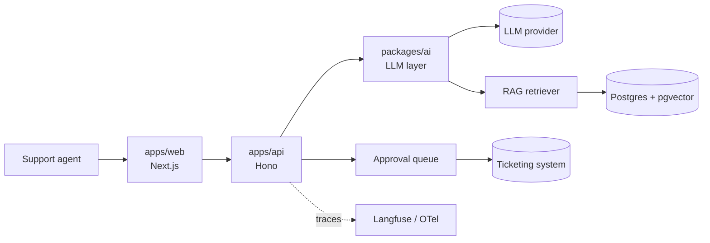

# Architecture

> Placeholder. To be completed as tasks land.

```mermaid
flowchart LR
  user[Support agent] --> web[apps/web<br/>Next.js]
  web --> api[apps/api<br/>Hono]
  api --> ai[packages/ai<br/>LLM layer]
  ai --> llm[(LLM provider)]
  ai --> rag[RAG retriever]
  rag --> pg[(Postgres + pgvector)]
  api --> approvals[Approval queue]
  approvals --> ticketing[(Ticketing system)]
  api -. traces .-> langfuse[Langfuse / OTel]
```

## Components

TODO

## Data flow

TODO

## Security and privacy

TODO (task 8)
